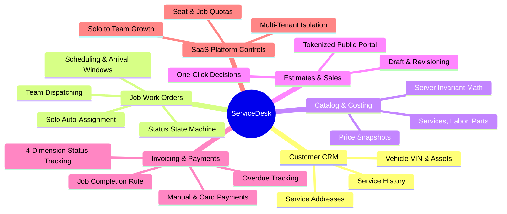
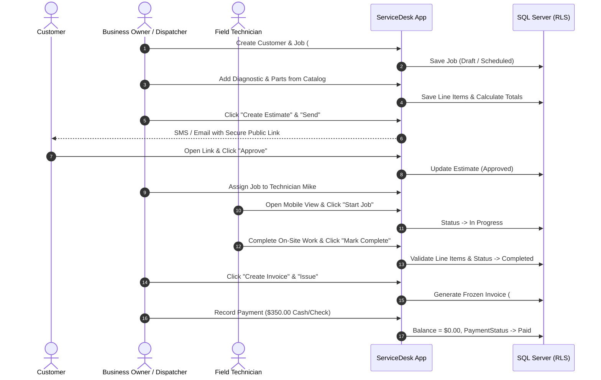

# ServiceDesk — Product Requirements Document (PRD)

**Document Version**: 1.0.0  
**Status**: Approved / Baseline  
**Product**: ServiceDesk (Multi-Tenant Field Service Management SaaS)  
**Target Industries**: Plumbing, Electrical, HVAC, Auto Repair & General Trade Services  

---

## 1. Executive Summary & Business Goals

### 1.1 Problem Statement
Small-to-midsize field service contractors (plumbers, electricians, mechanics, HVAC specialists) face significant friction managing their daily operations:
- Independent solo operators struggle with complex, bloated enterprise software requiring tedious overhead for single-person jobs.
- Growing businesses face painful, expensive migrations when scaling from a solo operator to a multi-technician dispatched team.
- Financial records are frequently corrupted when historical catalog pricing or customer addresses change after invoices or estimates have already been issued.
- Customers experience delays approving estimates and paying invoices due to lack of frictionless mobile customer portals.

### 1.2 Vision & Value Proposition
**ServiceDesk** is an all-in-one multi-tenant SaaS platform engineered specifically for trade service businesses. It enables a seamless operational spectrum: a solo operator can run their entire business with zero configuration overhead, and as they hire technicians, team dispatching, role-based controls, and seat-based subscriptions scale instantly **without database migration or data transfers**.

### 1.3 Strategic Business Objectives
1. **Reduce Time-to-Invoice**: Reduce the average duration from job completion to customer invoice dispatch from days to under 60 seconds.
2. **Accelerate Estimate Acceptance**: Deliver secure, mobile-optimized public estimate approval links, targeting a 35% improvement in customer response time.
3. **Zero-Friction Scalability**: Allow solo businesses to onboard their first employee in under 2 minutes with instant team UI activation.
4. **100% Financial Accuracy**: Guarantee immutable historical snapshots and server-verified financial calculations to prevent overpayments, under-billing, or rounding discrepancies.

---

## 2. Target Audience & User Personas

### 2.1 Persona 1: Solo Service Operator ("Alex - Independent Plumber")
- **Profile**: Owner-operator of a residential plumbing service. Works alone in the field.
- **Pain Points**: Needs quick mobile job creation, dislikes seeing complex dispatcher menus or assigning work to himself.
- **Key Goals**: Manage work orders on mobile, send estimates on-site, record cash/card payments, track outstanding balances.
- **System Experience**: "My Schedule" calendar, automatic work order assignment to self, team controls hidden.

### 2.2 Persona 2: Operations Manager ("Sarah - Office & Dispatch Manager")
- **Profile**: Manages a team of 6 technicians for a commercial electrical contractor.
- **Pain Points**: Scheduling conflicts, tracking parts markup, ensuring completed jobs have required line items before billing.
- **Key Goals**: Dispatch technicians by availability, track job status updates in real time, review work order line items, issue batch invoices.
- **System Experience**: Full dispatch calendar, multi-technician assignment pickers, price book management, team permissions.

### 2.3 Persona 3: Field Technician ("Mike - HVAC Specialist")
- **Profile**: On-site technician equipped with a mobile device/tablet.
- **Pain Points**: Needs clear work instructions and customer contact info without administrative distractions.
- **Key Goals**: View today's assigned jobs, update status (`Scheduled` $\rightarrow$ `In Progress` $\rightarrow$ `Completed`), record parts and labor used.
- **System Experience**: Restricted role; cannot view company billing, profit margins, or manage other staff.

### 2.4 Persona 4: End Customer ("David - Homeowner / Business Client")
- **Profile**: Homeowner or facility manager receiving service.
- **Pain Points**: Reluctant to download an app or create an account just to approve an estimate.
- **Key Goals**: Review itemized scope of work on their mobile phone, click "Approve" or "Decline", receive clear receipts.
- **System Experience**: Lightweight, branded web portal accessed via secure tokenized link with zero login required.

---

## 3. Core Features & Functional Scope

### 3.1 Customer & Multi-Asset CRM
- Customer directory with live search filtering by name, phone, email, or service address.
- Support for multiple service locations and assets under a single customer:
  - **Property Service Locations**: Physical address, gate codes, access notes.
  - **Vehicles**: VIN, year, make, model, license plate, mileage.
  - **Equipment**: Brand, serial number, warranty status, installation date.
- Complete historical work order, estimate, and invoice audit ledger per customer/asset.

### 3.2 Job & Work Order Lifecycle
- Flexible job scheduling with dates and arrival windows (e.g., `9:00 AM - 10:30 AM`).
- Strict status state machine: $\text{Draft} \rightarrow \text{Scheduled} \leftrightarrow \text{InProgress} \leftrightarrow \text{OnHold} \rightarrow \text{Completed}$ (or $\text{Cancelled}$).
- **Completion Invariant**: A job must contain at least one line item (service, labor, or material) before it can be marked `Completed`.
- Internal instructions and customer-facing service notes.

### 3.3 Price Book & Job Costing
- Reusable catalog item categories: `Service`, `Labor`, `Part`.
- Historical snapshot freezing: When added to a job, unit prices and descriptions are copied into job line items to protect against future price book updates.
- Real-time server-side recalculated financial totals: Subtotal, Line Discounts, Sales Tax, and Grand Total.

### 3.4 Estimates & Customer Approval Portal
- Generate estimates directly from work order items.
- Tokenized public approval links (`{BusinessId:N}.{secret}`) stored as SHA-256 hashes.
- 30-day automatic link expiration, revocation upon estimate revision, and instant consumption upon decision.
- Clean customer decision portal with digital name/email signature verification.

### 3.5 Invoicing & Payment Reconciliation
- One-click invoice generation from `Completed` work orders (enforcing 1 live invoice per job).
- Distinct four-dimensional status tracking:
  1. *Invoice Lifecycle*: `Draft`, `Issued`, `Voided`
  2. *Delivery Status*: `NotSent`, `Queued`, `Sent`, `Failed`
  3. *Payment Status*: `Unpaid`, `PartiallyPaid`, `Paid`
  4. *Overdue Status*: Automatically computed from due date and outstanding balance.
- Partial and full payment recordings with overpayment guards and automated balance recalculations.

### 3.6 Multi-Tenant SaaS Management
- Isolated workspaces powered by SQL Server `SESSION_CONTEXT(N'BusinessId')` and engine-level Row-Level Security (RLS).
- Subscription tiers (`Solo`, `Team`, `Growth`) enforcing seat quotas, monthly job creation limits, and feature entitlements.
- Frictionless solo-to-team upgrade and safe team-to-solo downgrade review.

---

## 4. Step-by-Step User Flows

### 4.1 End-to-End Field Service Flow

---

## 5. Non-Functional Requirements & Success Metrics

| Dimension | Target Metric | Implementation Strategy |
|---|---|---|
| **API Response Time** | $\le 150\text{ ms}$ for 95th percentile | Explicit `SqlParameter` types, compiled execution plans via `BaseDAL`, optimal indexes. |
| **Tenant Isolation** | Zero cross-tenant leakage | SQL Server RLS security predicates on every table; generic `404 resource_not_found` anti-enumeration. |
| **Mobile Responsiveness** | Fully functional on viewports $\ge 390\text{px}$ | Mobile-first CSS, custom `@ng-select` components, fixed bottom navigation bar, `.table-scroll`. |
| **Availability** | $99.9\%$ uptime | Stateless API containers, connection retry policies, health probes (`/health/live`, `/health/ready`). |
| **Data Integrity** | $100\%$ financial audit trail | Immutable document snapshots, rowversion optimistic concurrency control, append-only audit events. |
