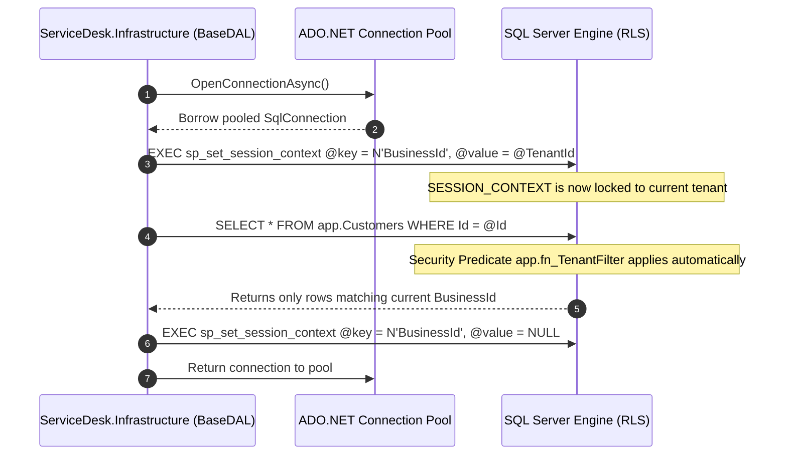

# ServiceDesk — Technical Architecture Document (TAD)

**Document Version**: 1.0.0  
**Status**: Approved / Baseline  
**Target Platform**: Microsoft .NET 10 / SQL Server 2022+ / Angular 22 / Node.js 22 LTS  

---

## 1. System Architecture Overview

ServiceDesk is architected as an **inward-pointing modular monolith**. It combines the rapid development and transactional consistency of a monolithic codebase with clean domain boundaries, strict multi-tenant isolation, and modular feature encapsulation:

```text
┌──────────────────────────────────────────────────────────┐
│                   Angular 22 SPA Clients                 │
│    (Desktop Web / Tablet Drawer / Mobile Responsive UI)  │
└────────────────────────────┬─────────────────────────────┘
                             │ HTTPS / REST (JSON RFC 8259)
                             ▼
┌──────────────────────────────────────────────────────────┐
│             ServiceDesk.Api (ASP.NET Core 10)            │
│  - Centralized Exception & ProblemDetails Middleware     │
│  - JWT & Development Auth Handlers                       │
│  - Route-based Tenant & Active Membership Resolution     │
│  - Permission Authorization Policies                     │
└────────────────────────────┬─────────────────────────────┘
                             │
                             ▼
┌──────────────────────────────────────────────────────────┐
│        ServiceDesk.Application (CQRS / Use Cases)        │
│  - Command & Query Handlers                              │
│  - Business Invariants & Quota / Entitlement Checks      │
│  - Transport DTOs & Validation Rules                     │
└────────────────────────────┬─────────────────────────────┘
                             │
                             ▼
┌──────────────────────────────────────────────────────────┐
│           ServiceDesk.Domain (Enterprise Rules)          │
│  - Aggregates (Job, Customer, Invoice, Estimate)         │
│  - State Machine Enums & Status Transition Rules         │
│  - Financial Math (Zero Third-Party Dependencies)        │
└────────────────────────────▲─────────────────────────────┘
                             │
                             │ Implements Interfaces
┌────────────────────────────┴─────────────────────────────┐
│       ServiceDesk.Infrastructure (Data & Integrations)   │
│  - BaseDAL.cs (SqlConnection, SESSION_CONTEXT, Timeout)  │
│  - Feature Services (CustomerService, JobService, etc.)  │
│  - SQL Multiline Parameterized Queries                   │
└────────────────────────────┬─────────────────────────────┘
                             │ ADO.NET (Microsoft.Data.SqlClient)
                             ▼
┌──────────────────────────────────────────────────────────┐
│        Microsoft SQL Server (Tenant-Isolated Database)   │
│  - SESSION_CONTEXT(N'BusinessId') Filter                 │
│  - Row-Level Security (RLS) Security Predicates          │
│  - Optimistic Concurrency Control (rowversion)           │
│  - Restricted Runtime Login (servicedesk_runtime)        │
└──────────────────────────────────────────────────────────┘
```

---

## 2. Technology Stack & Component Specifications

| Layer | Technology Choice | Rationale & Specifications |
|---|---|---|
| **Frontend Framework** | Angular 22 (Standalone Components) | Strict typing, enterprise reactivity with Signals, built-in router, clean DI. |
| **UI Components & CSS** | Vanilla SCSS + `@ng-select` | High-performance CSS design system, zero dependency on bulky UI frameworks, custom custom select styling. |
| **Backend Framework** | ASP.NET Core 10 (C# 13) | Industry-leading throughput, native async I/O, strict nullable reference types, robust DI. |
| **Data Access Layer** | ADO.NET via Centralized `BaseDAL` | Zero ORM overhead, predictable SQL execution plans, explicit `SqlDbType` and parameter lengths. |
| **Relational Database** | Microsoft SQL Server (2022+ / Azure SQL) | Native Row-Level Security, `SESSION_CONTEXT`, `rowversion` concurrency tokens, clustered indexes. |
| **API Protocol** | RESTful HTTP / JSON | CamelCase JSON, RFC 3339 UTC timestamps, RFC 7807 `ProblemDetails` error contracts. |
| **Testing Framework** | xUnit, FluentAssertions, Karma/Jasmine | Comprehensive unit tests, SQL integration tests, and UI component tests. |

---

## 3. Database Architecture & Multi-Tenant Isolation

### 3.1 Tenant Isolation Mechanism
Multi-tenant security is enforced at both the application layer and the database engine level:



### 3.2 Row-Level Security (RLS) Engine Predicate
Every tenant-owned table (`app.Customers`, `app.Jobs`, `app.Invoices`, `app.Estimates`, `app.CatalogItems`) includes a `BusinessId UNIQUEIDENTIFIER NOT NULL` column and is guarded by:

```sql
CREATE FUNCTION app.fn_TenantFilter(@BusinessId UNIQUEIDENTIFIER)
RETURNS TABLE
WITH SCHEMABINDING
AS
RETURN (
    SELECT 1 AS AccessGranted
    WHERE @BusinessId = CAST(SESSION_CONTEXT(N'BusinessId') AS UNIQUEIDENTIFIER)
);

CREATE SECURITY POLICY app.TenantSecurityPolicy
ADD FILTER PREDICATE app.fn_TenantFilter(BusinessId) ON app.Customers,
ADD BLOCK PREDICATE app.fn_TenantFilter(BusinessId) ON app.Customers,
ADD FILTER PREDICATE app.fn_TenantFilter(BusinessId) ON app.Jobs,
ADD BLOCK PREDICATE app.fn_TenantFilter(BusinessId) ON app.Jobs;
```

### 3.3 BaseDAL Engineering Standards
All SQL Server interactions pass strictly through `src/ServiceDesk.Infrastructure/Data/BaseDAL.cs`:
- **No `AddWithValue`**: Every parameter explicitly declares its `SqlDbType`, size, precision, and scale to avoid type coercions and plan cache invalidation.
- **Connection Isolation**: `SESSION_CONTEXT(N'BusinessId')` is set immediately upon opening.
- **Typed Exception Mapping**: Catches SQL constraint, concurrency, and deadlock exceptions and transforms them into infrastructure exceptions (`DataAccessException`, `ConcurrencyException`).
- **Transaction Safety**: Supports transactional execution callbacks with configurable isolation levels (`ReadCommitted`, `Serializable`).

---

## 4. Security, Authentication & Authorization

### 4.1 Token Validation & Anti-Enumeration
1. **JWT & OIDC Authentication**: Validates digital signatures, issuer, and expiration.
2. **Active Membership Resolution**: Even if a JWT is cryptographically valid, the API queries active memberships for the route `businessId`. If a user was removed or deactivated, requests fail immediately.
3. **Generic 404 Anti-Enumeration Rule**: Accessing a nonexistent resource or a resource belonging to another tenant returns the exact same response:
   ```json
   {
     "type": "https://errors.servicedesk.example/resource_not_found",
     "title": "Resource Not Found",
     "status": 404,
     "detail": "The requested resource could not be found."
   }
   ```
   This strictly prevents malicious actors from probing whether tenant IDs or resource IDs exist.

### 4.2 Permission Matrix & Entitlement Authorization
Every endpoint enforces a permission policy and a subscription plan entitlement check:
- `customers.read`, `customers.write`
- `jobs.read`, `jobs.write`
- `catalog.read`, `catalog.write`
- `estimates.manage`, `invoices.manage`, `payments.manage`
- `settings.manage`, `team.manage`

---

## 5. Deployment Topology & Environments

```text
[ Cloudflare / Reverse Proxy & CDN ]
               │ SSL Termination (TLS 1.3)
               ▼
   [ Application Gateway / Ingress ]
      ├── /app/*, /*         ──► [ Angular SPA Static Host (S3 / Azure Static Web Apps) ]
      └── /api/*, /health/*  ──► [ ASP.NET Core API Container Cluster (Kestrel / Linux) ]
                                            │
                                            ▼
                             [ Microsoft SQL Server Managed Instance ]
                             - Primary (Read/Write OLTP)
                             - Read-Replica (Reporting & Analytical Exports)
```

---

## 6. Verification & Health Monitoring

The API exposes unauthenticated health endpoints for container orchestrators (Kubernetes / Docker):
- `GET /health/live`: Verifies internal process responsiveness.
- `GET /health/ready`: Executes a verified `SELECT 1` query against the database using the restricted runtime credentials to confirm database connectivity.
