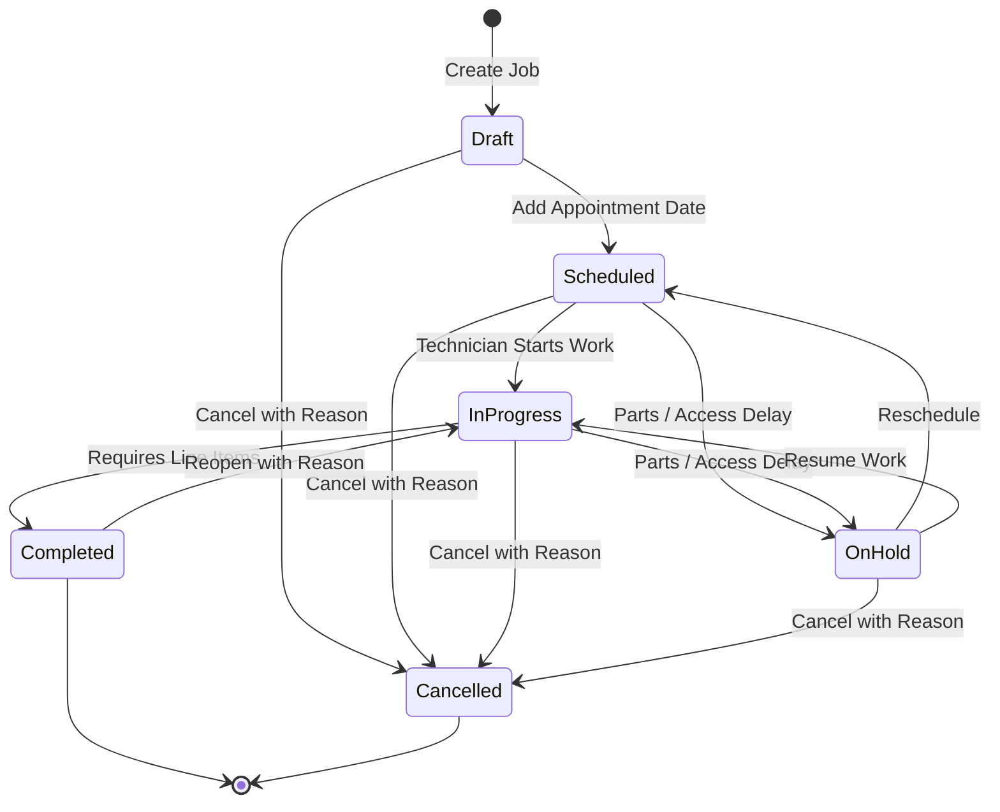

# ServiceDesk — Functional Specification Document (FSD)

**Document Version**: 1.0.0  
**Status**: Approved / Baseline  
**Scope**: Business Logic, Validation Invariants, State Machines & API Integrations  

---

## 1. Domain State Machines & Status Transitions

### 1.1 Job Lifecycle State Machine



#### Transition Invariants & Enforcement Rules
1. **Scheduling Rule**: Transition to `Scheduled` requires `scheduledDate` ($\ge \text{Today}$).
2. **Completion Rule**: Transition to `Completed` strictly requires at least one service, labor, or material line item attached to the job.
3. **Audit Rule**: Any transition to `Cancelled` or reopening from `Completed` to `InProgress` mandates a non-empty `reason` string logged in the audit trail.
4. **Assignment Invariant**: In solo mode, newly scheduled jobs default to the active business owner if no technician is selected.

---

### 1.2 Four-Dimensional Financial Status Model

To guarantee financial truth, invoice state is separated across four independent axes:

```text
┌─────────────────────────┐     ┌─────────────────────────┐
│     Invoice Lifecycle   │     │     Delivery Status     │
│   Draft ──► Issued      │     │  NotSent ──► Queued     │
│              │          │     │     │           │       │
│              ▼          │     │     ▼           ▼       │
│           Voided        │     │   Failed ◄──── Sent     │
└─────────────────────────┘     └─────────────────────────┘
┌─────────────────────────┐     ┌─────────────────────────┐
│     Payment Status      │     │      Overdue Status     │
│   Unpaid ──► PartPaid   │     │  Dynamic Boolean:       │
│      │          │       │     │  (DueDate < Today) AND  │
│      ▼          ▼       │     │  (Balance > 0)          │
│           Paid          │     │                         │
└─────────────────────────┘     └─────────────────────────┘
```

---

## 2. Financial Math & Calculation Invariants

### 2.1 Rounding and Calculation Formula
The API ignores client-calculated financial numbers and re-computes line items, discounts, taxes, and grand totals using banker's rounding (`MidpointRounding.ToEven`) at two decimal places:

$$\text{Extended Price} = \text{round}(\text{Quantity} \times \text{UnitPrice}, 2)$$
$$\text{Line Discount} \le \text{Extended Price} \quad (\text{Discount cannot exceed extended price})$$
$$\text{Taxable Amount} = \text{Extended Price} - \text{Line Discount}$$
$$\text{Line Tax} = \text{round}(\text{Taxable Amount} \times \text{TaxRate}, 2)$$
$$\text{Line Total} = \text{Taxable Amount} + \text{Line Tax}$$
$$\text{Invoice Grand Total} = \sum \text{Line Totals}$$
$$\text{Current Balance} = \text{Invoice Grand Total} - \sum \text{Recorded Payments}$$

### 2.2 Payment Reconciliation Rules
- **Overpayment Guard**: Recording a payment with $\text{Amount} > \text{Current Balance}$ returns HTTP `422 unprocessable_entity` with code `overpayment_not_permitted`.
- **Zero Balance Settlement**: When $\text{Balance} = \$0.00$, the system automatically transitions `PaymentStatus` to `Paid`.

---

## 3. Data Validation & Integrity Rules

| Entity / Field | Validation Invariant | Error Code | HTTP Status |
|---|---|---|---|
| **Customer Name** | Required, trimmed, max 200 characters | `customer_name_required` | 400 Bad Request |
| **Customer Email** | Optional, valid RFC 5322 format | `invalid_email_format` | 400 Bad Request |
| **Customer Phone** | Optional, valid 10-digit US format (E.164) | `invalid_phone_format` | 400 Bad Request |
| **Job Title** | Required, 3–200 characters | `job_title_required` | 400 Bad Request |
| **Line Item Qty** | Greater than 0.0001, max 99,999 | `invalid_quantity` | 400 Bad Request |
| **Line Item Price** | Greater than or equal to $0.00 | `price_cannot_be_negative` | 400 Bad Request |
| **Public Link Token** | Format `{BusinessId:N}.{secret}`, valid SHA-256 match, not expired | `invalid_public_token` | 404 Not Found |
| **Seat Limit** | Active Members + Pending Invitations $\le$ Plan Seat Quota | `plan_limit_reached` | 409 Conflict |

---

## 4. API Error Handling (RFC 7807 ProblemDetails)

Every business error or validation failure adheres to the RFC 7807 `ProblemDetails` standard:

```json
{
  "type": "https://errors.servicedesk.example/validation_failed",
  "title": "Validation Failed",
  "status": 400,
  "detail": "One or more input fields failed validation.",
  "traceId": "00-4bf92f3577b34da6a3ce929d0e0e4736-00",
  "errors": {
    "email": ["The email address format is invalid."],
    "phone": ["Phone must be a valid 10-digit phone number."]
  }
}
```

---

## 5. Third-Party Integrations Specification

### 5.1 Stripe Billing & Webhook Processing
- **Flow**: Checkout session creation $\rightarrow$ Hosted Stripe checkout $\rightarrow$ Signed Webhook delivery.
- **Webhook Security**: Validates `Stripe-Signature` header against webhook signing secret.
- **Idempotency**: Webhook event IDs (`evt_xxx`) are stored in `platform.WebhookEvents`. Repeated webhook deliveries are safely acknowledged with HTTP 200 without duplicate processing.

### 5.2 Transactional Outbox Pattern (Email Delivery)
- Transactional messages (e.g., Estimate Approval Links, Invoice Send) are written directly to an append-only `app.OutboxMessages` table in the **same database transaction** as the business mutation.
- A background worker reads unprocessed messages, delivers them via SendGrid/Postmark, and updates delivery status (`Sent` / `Failed`).
