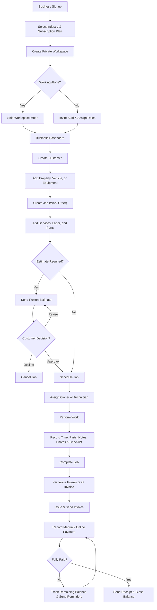
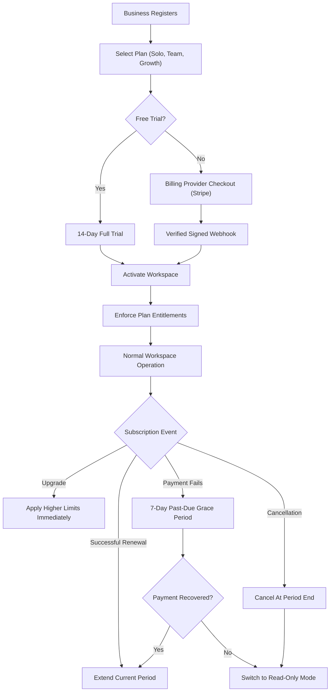

# ServiceDesk — Comprehensive System & All-Phases Master Specification

This document is the authoritative master specification for the **ServiceDesk** multi-tenant Field Service & Service Desk Management system. It unifies the end-to-end business workflows, SaaS subscription mechanics, domain state machines, multi-tenant database standards, delivered phases (1 through 5), UI/UX implementations, and the Phase 6 roadmap.

---

## 1. End-to-End System Workflow

The following flowchart illustrates the entire business lifecycle from business onboarding through job execution, customer invoicing, and SaaS subscription management:

---

## 2. Official 11-Phase Implementation Plan & Delivery Status

The project architecture builds **one multi-tenant SaaS application** using Angular + ASP.NET Core Web API. Solo businesses and teams use the same workspace and database; staff membership and permissions determine the experience.

The structure is an Angular frontend, a modular ASP.NET Core API, a relational SQL Server database with Row-Level Security, private file storage, and background processing for reminders, exports, and billing events:

| Phase | Angular Frontend | ASP.NET Core API and Database | Completion Criteria | Status in Codebase |
|---|---|---|---|---|
| **1. Requirements and UI design** | Complete Figma screens for onboarding, solo/team dashboards, customers, jobs, scheduling, estimates, invoices, subscriptions, and administration. Include loading, empty, validation, and permission states. | Finalize database relationships (47 tables), API contracts (104 OpenAPI ops), roles, job/invoice statuses, subscription rules, and tenant boundaries. | Main workflows and screen behavior are documented, including solo ↔ team transitions. | **100% Complete** (`outputs/backend-spec/*`) |
| **2. Project and SaaS foundation** | Application shell, navigation, authentication screens, reusable forms/tables, error handling, responsive layouts. | Solution structure (.NET 10 modular monolith), authentication, business workspaces, membership checks, tenant-scoped queries, migrations, logging, audit events, private storage, backup configuration, CI/CD. | Two test businesses cannot access each other’s records or files. Development and staging deployments work. | **100% Complete** (`ServiceDesk.Api`, `ServiceDesk.Infrastructure`, `ServiceDesk.Web`) |
| **3. Onboarding and staff management** | Business setup, industry selection, "Just me / I have a team," staff invitations, role management, personal/team navigation. | Businesses, users, memberships, invitations, roles, permissions, invitation expiration, membership deactivation, access revocation, seat entitlement checks. | A solo owner can invite staff, assign permissions, and remove access while preserving history. | **100% Complete** (Solo owner default assignment, team roles & permissions enforced) |
| **4. Customers, locations, and catalog** | Customer directory and details, service addresses, vehicles/equipment, services, labor rates, materials/parts catalog. | Customer/location/asset/catalog APIs, validation, search, pagination, archival, industry-specific fields. | A customer can have several locations or assets, with business-scoped records. | **100% Complete** (Live `/customers`, `/catalog-items`, `@ng-select` components) |
| **5. Jobs and scheduling** | Create/edit jobs, labor and parts, personal/team calendar, assignments, status updates, notes, photos, mobile technician screens. | Jobs, line items, appointments, assignments, time records, attachments, status transitions, assignment notifications. | A solo owner or assigned technician can manage a job through completion. | **100% Complete** (Live `/jobs`, `/jobs/{id}/items`, `/jobs/{id}/status`, mobile 390px views) |
| **6. Estimates, invoices, and customer payments** | Estimate builder and approval page, additional-work approval, invoice preview/PDF, payment entry, receipts, balances, custom SMTP. | Estimate revisions and approvals, pricing snapshots, configurable taxes/discounts, invoice numbering, binary PDF generation, partial payments, payment reversals/refunds, custom SMTP settings, outbox processor. | Approved work can become an invoice; balances remain correct after partial payments and adjustments. | **100% Complete** (Live `/estimates`, `/invoices`, public portal `/estimate/:token`, payments, custom SMTP at `/app/settings/smtp`, headless binary PDF downloads) |
| **7. SaaS subscription billing** | Plans, checkout, trial status, billing history, seat usage, upgrades, cancellations, downgrade preview. | Billing provider integration, verified/idempotent webhooks, subscription lifecycle, plan entitlements, usage limits, grace-period rules, scheduled plan changes. | Paid access and limits follow subscription state without duplicate charges or duplicate event processing. | **100% Complete** (Live `/app/subscription`, Solo/Team/Pro plans, live quota meters, downgrade blocker validation, lifecycle simulation) |
| **8. Dashboard, reports, and data controls** | Business dashboard, job/financial reports, filters, exports, notification preferences, audit history. | Reporting queries, export jobs, expiring downloads, invoice reminders, retention and account deletion workflows. | Reports reconcile with source records; exports contain only authorized business data. | **Partially Complete** (Live business overview with stat cards; deep report exports in roadmap) |
| **9. Platform administration** | Business accounts, plans, subscriptions, support access, platform health, audit and backup status. | Separate administrator authorization, controlled support grants, account status management, operational metrics, restore procedures. | Administrative access is restricted and audited; backup restoration is successfully tested. | **Architecture Scaffolded** |
| **10. Launch verification and rollout** | Accessibility, mobile usability, workflow polish, user guidance. | Security review, performance checks, monitoring/alerts, deployment migrations, rollback and recovery validation. | Pilot businesses complete realistic workflows; critical failures are resolved before paid launch. | **Active** (Multi-device responsive testing passed across Desktop, Tablet, Mobile) |
| **11. Industry expansion** | Vehicle inspections, service bay scheduling, field dispatch, recurring jobs, inventory, customer portal. | Industry-specific workflows, inventory movements, recurring scheduling, accounting/payment integrations. | New features are introduced based on actual business usage and feedback. | **Future Release** |

---

## 3. Solo vs. Team Operation (Zero-Migration Architecture)

ServiceDesk is designed to seamlessly serve both a **solo owner-operator** (e.g., an independent plumber, electrician, or mechanic) and a **growing service enterprise** with technicians and managers without requiring data migrations or separate databases.

### Solo Mode
* **Auto-Assignment**: The business owner is automatically assigned to newly scheduled jobs.
* **Simplified UI**: Team management, technician assignment pickers, and multi-staff calendars remain unobtrusively hidden; the calendar operates as "My Schedule".
* **Fully Team-Ready**: The underlying SQL database rows, tenant composite keys, and API contracts are fully multi-user capable from day one.

### Upgrading from Solo to Team
1. The owner navigates to team settings and invites an employee.
2. The API checks the subscription's active seat entitlement (`seats.limit`).
3. A pending invitation reserves a seat until accepted, expired, or revoked.
4. When the invitation is accepted, the employee receives an assigned role (`Manager` or `Technician`).
5. Team scheduling, dispatch controls, and technician filter dropdowns automatically appear throughout the Angular UI.
6. Existing historical jobs remain with the owner until explicitly reassigned.

### Returning from Team to Solo (Downgrade Preview)
Before downgrading from a Team plan to a Solo plan, the API enforces a strict transition review:
* Validates active staff count, pending invitations, open assigned work orders, and scheduled future appointments.
* Provides a transition preview requiring the owner to reassign unfinished work to themselves, revoke outstanding invitations, and deactivate employee memberships.
* **Historical Audit Preserved**: Historical job logs, time records, and invoice audit entries continue to display the employee who originally performed the work.

---

## 4. Domain Model & Asset Tracking

Field work always attaches to a **Customer** and the **Asset** being serviced:
* **Plumbing / Electrical**: Physical property address and service location details.
* **Automotive Repair**: Vehicle record (VIN, Year, Make, Model, License Plate, Mileage).
* **Equipment & Appliances**: Model, serial number, warranty status, and installation date.

A customer can maintain multiple properties, vehicles, or equipment assets. Every completed job permanently links into that asset's historical service ledger.

---

## 5. Job State Machine & Financial Snapshots

### Job Lifecycle State Machine
Jobs follow strict, auditable state transitions:
$$\text{Draft} \longrightarrow \text{Scheduled} \longleftrightarrow \text{InProgress} \longleftrightarrow \text{OnHold} \longrightarrow \text{Completed}$$
$$(\text{Draft}, \text{Scheduled}, \text{InProgress}, \text{OnHold}) \longrightarrow \text{Cancelled}$$

* **Rules & Invariants**:
  - Transitioning to `Scheduled` requires an appointment date.
  - Transitioning to `Completed` strictly requires at least one service, labor, or material line item.
  - Reopening a `Completed` job back to `InProgress` requires an explicit, audited reason.
  - Cancelling a job requires a reason.

### Four-Dimension Financial Status Separation
To ensure financial accuracy, ServiceDesk strictly isolates invoice lifecycle, delivery, payment, and overdue calculations into distinct dimensions:

| Dimension | Possible States | Meaning |
|---|---|---|
| **Invoice Lifecycle** | `Draft`, `Issued`, `Voided` | Document lifecycle and financial commitment state |
| **Delivery Status** | `NotSent`, `Queued`, `Sent`, `Failed` | Outbound communication status via email/portal |
| **Payment Status** | `Unpaid`, `PartiallyPaid`, `Paid` | Settlement state based on verified recorded payments |
| **Overdue Status** | `Boolean (isOverdue)` | Computed dynamically: $(\text{DueDate} < \text{CurrentDate}) \land (\text{Balance} > 0)$ |

* **Immutable Document Snapshots**:
  When an estimate or invoice is created, customer details (name, billing address) and line items (descriptions, quantities, unit prices, discounts, taxes) are copied into immutable document snapshot tables. Future price book edits or customer address changes never alter issued financial records.
* **Financial Calculation Standard**:
  $$\text{Line Total} = \text{round}(\text{Quantity} \times \text{UnitPrice}, 2) - \text{Discount} + \text{Tax}$$
  All calculations occur server-side; client-supplied totals are strictly validated and recalculated.

---

## 6. SaaS Subscription System vs. Customer Invoicing

A fundamental architectural distinction in ServiceDesk:
* **Customer Invoices**: Documents issued by the service business to their customers for completed work.
* **SaaS Subscriptions**: How the service business pays ServiceDesk for software access.

### SaaS Subscription Statuses
* **`Trialing`**: Full platform access during the 14-day evaluation period.
* **`Active`**: Subscription is current, paid, and renewing.
* **`PastDue`**: Renewal payment failed; business is in a 7-day grace period with full operational access.
* **`ReadOnly`**: Grace period expired or subscription ended. Mutating operations (creating jobs, invoices, customers) are blocked; data export, payment method updates, and viewing remain available.
* **`Ended`**: Workspace terminated following retention policy.

### Entitlement Enforcement
The API queries `platform.PlanEntitlements` before processing operations:
* **Seats**: Active members + pending invitations $\le$ `seats.limit`.
* **Monthly Jobs**: Jobs created in current billing window $\le$ `jobs.limit`.
* **Storage**: Uploaded file assets $\le$ `storage.limit`.
* **Feature Flags**: Estimates, premium reports, and customer portal require `Enabled = true`.

---

## 7. Multi-Tenant Security & Database Architecture

Dependencies point strictly inward: `Domain` $\leftarrow$ `Application` $\leftarrow$ `Infrastructure` $\leftarrow$ `Api` $\leftarrow$ `Web`.

* **Connection & Tenant Isolation Standard**:
  - All SQL queries execute through [BaseDAL.cs](file:///d:/TempDebug/SBJT/src/ServiceDesk.Infrastructure/Data/BaseDAL.cs).
  - Every connection explicitly sets SQL Server `SESSION_CONTEXT(N'BusinessId', @BusinessId)` prior to query execution.
  - SQL Server Row-Level Security (`app.fn_TenantFilter`) enforces tenant isolation at the engine level.
  - Connection pooling safeguards: tenant context is overwritten upon connection checkout and reset upon release.
* **Anti-Enumeration Boundary**:
  - Queries for nonexistent resources and foreign tenant resources return the exact same generic `404 resource_not_found` ProblemDetails response.
* **Database Credentials & Concurrency**:
  - Restricted runtime API user (`servicedesk_runtime`), never `sa` or `db_owner`.
  - Optimistic concurrency control via SQL `rowversion` / `ETag` checks.

---

## 8. Delivered Implementation Slices (Slices 1 through 5)

| Phase | Core Deliverables | API Routes | UI Components |
|---|---|---|---|
| **Phase 1: Foundation** | Modular monolith solution, auth policies, health probes (`/health/live`, `/health/ready`), tenant context, BaseDAL, RLS. | `/health/*`, `/api/v1/me` | App Shell, Navigation, Overview, Login |
| **Phase 2: CRM & Jobs** | Customer lifecycle, Work orders, Solo/Team assignment, Subscription job limits check. | `/customers`, `/jobs` | Customers Live List, Customer Form, Jobs Board, Job Create Form |
| **Phase 3: Catalog & Costing** | Price book (`Service`, `Labor`, `Part`), line items, server-calculated totals, price snapshot immutability. | `/catalog-items`, `/jobs/{id}/items` | Services & Parts Price Book, Job Line Items Editor |
| **Phase 4: Invoicing & Pay** | Job completion rules, Draft $\rightarrow$ Issued invoices, manual payment balance reconciliation, overpayment guard. | `/jobs/{id}/status`, `/invoices`, `/invoices/{id}/payments` | Invoices Board, Record Payment Modal, Job Completion Actions |
| **Phase 5: Estimate Approval** | Secure public link (`{BusinessId}.{secret}` with SHA-256 hash), customer approval portal, revision management. | `/estimates`, `/estimates/{id}/send`, `/public/estimates/{token}` | Estimates Pipeline, Estimate Detail, Public Customer Portal |

---

## 9. QA, UX & Responsive Polish (Delivered)

* **Dropdown Modernization**: Converted all native `<select>` dropdowns across Jobs, Invoices, Estimates, Catalog, and Customer forms to `@ng-select` with `.filter-ng-select` pill styling.
* **Caret Position Fix**: Resolved the input cursor artifact (`|mahipal`) in searchable `@ng-select` components by styling `.ng-has-value:not(.ng-select-filtered)` with `caret-color: transparent !important`.
* **Sidebar Contrast**: Enforced `#c9d7dd` unselected navigation link text and `#ffffff` active text on `#1c4653` capsule background.
* **Multi-Device Responsive Support**:
  - **Desktop (1920x945)**: Full multi-column grids, persistent sidebar, deep document linking.
  - **Tablet (768x1024)**: Responsive 2x2 stat cards, hamburger drawer menu with dark backdrop scrim.
  - **Mobile (390x844)**: Stacked form fields, `.table-scroll` horizontal data protection, bottom navigation bar.

---

## 10. Complete API Route Matrix

| Category | HTTP Method | Endpoint | Permission Policy | Description |
|---|---|---|---|---|
| **Health** | GET | `/health/live` | Anonymous | Liveness probe |
| **Health** | GET | `/health/ready` | Anonymous | Readiness probe (SQL connectivity) |
| **Identity** | GET | `/api/v1/me` | Authenticated | Current user & tenant membership |
| **Customers** | GET | `/api/v1/businesses/{businessId}/customers` | `customers.read` | List & search customers |
| **Customers** | POST | `/api/v1/businesses/{businessId}/customers` | `customers.write` | Create customer |
| **Customers** | GET | `/api/v1/businesses/{businessId}/customers/{customerId}` | `customers.read` | Customer details & job history |
| **Jobs** | GET | `/api/v1/businesses/{businessId}/jobs` | `jobs.read` | List & filter jobs by status/search |
| **Jobs** | POST | `/api/v1/businesses/{businessId}/jobs` | `jobs.write` | Create work order (checks plan limits) |
| **Jobs** | GET | `/api/v1/businesses/{businessId}/jobs/{jobId}` | `jobs.read` | Job details & status |
| **Jobs** | POST | `/api/v1/businesses/{businessId}/jobs/{jobId}/status` | `jobs.write` | Transition job status (state machine) |
| **Job Items** | GET | `/api/v1/businesses/{businessId}/jobs/{jobId}/items` | `jobs.read` | Retrieve job line items |
| **Job Items** | PUT | `/api/v1/businesses/{businessId}/jobs/{jobId}/items` | `jobs.write` | Atomic replace items & recalculate |
| **Catalog** | GET | `/api/v1/businesses/{businessId}/catalog-items` | `catalog.read` | List price book items |
| **Catalog** | POST | `/api/v1/businesses/{businessId}/catalog-items` | `catalog.write` | Create reusable price book item |
| **Estimates** | GET | `/api/v1/businesses/{businessId}/estimates` | `estimates.manage` | List pipeline estimates |
| **Estimates** | POST | `/api/v1/businesses/{businessId}/jobs/{jobId}/estimates` | `estimates.manage` | Generate estimate from job items |
| **Estimates** | GET | `/api/v1/businesses/{businessId}/estimates/{estimateId}` | `estimates.manage` | Read estimate detail snapshot |
| **Estimates** | POST | `/api/v1/businesses/{businessId}/estimates/{estimateId}/send` | `estimates.manage` | Mark estimate as Sent |
| **Estimates** | POST | `/api/v1/businesses/{businessId}/estimates/{estimateId}/revisions` | `estimates.manage` | Create revision estimate |
| **Estimates** | POST | `/api/v1/businesses/{businessId}/estimates/{estimateId}/links` | `estimates.manage` | Generate secure public approval link |
| **Public** | GET | `/api/v1/public/estimates/{token}` | Anonymous | Read public estimate details |
| **Public** | POST | `/api/v1/public/estimates/{token}/decision` | Anonymous | Record customer decision (Approve/Decline) |
| **Invoices** | GET | `/api/v1/businesses/{businessId}/invoices` | `invoices.manage` | List accounts receivable invoices |
| **Invoices** | POST | `/api/v1/businesses/{businessId}/jobs/{jobId}/invoices` | `invoices.manage` | Generate invoice from completed job |
| **Invoices** | GET | `/api/v1/businesses/{businessId}/invoices/{invoiceId}` | `invoices.manage` | Read invoice detail snapshot |
| **Invoices** | POST | `/api/v1/businesses/{businessId}/invoices/{invoiceId}/issue` | `invoices.manage` | Issue invoice & set due date |
| **Invoices** | POST | `/api/v1/businesses/{businessId}/invoices/{invoiceId}/payments` | `payments.manage` | Record payment & update balance |

---

## 11. Phase 6 & Beyond Roadmap

1. **Transactional Outbox & Email Delivery**:
   - Outbox pattern for reliable email dispatch via SendGrid/Postmark.
   - Branded customer email notifications with secure estimate approval links and invoice payment links.
2. **Server-Side PDF Generation**:
   - Headless PDF generation for estimates, work orders, and official invoices.
3. **Idempotency Keys**:
   - Client-provided `Idempotency-Key` headers for payment recordings and invoice issuance to guarantee zero duplicate charges on network retries.
4. **Credit Notes & Payment Gateways**:
   - Stripe integration for customer card payments on public invoices, partial payment support, and credit note issuance.

---

## 12. Project Timeline, Resource Estimation & AI Acceleration Analysis

A comprehensive comparison of the engineering effort required to develop the **ServiceDesk** MVP:

### Development Effort Breakdown by Phase

| Phase / Scope Component | Traditional Development (Working Days) | AI-Assisted Development (Working Days) | Current Status in this Workspace |
|---|---|---|---|
| **1. Requirements, Schema Design, Contracts & UI** | 7–10 days | 4–6 days | **Completed** (47 tables, 104 OpenAPI ops, Figma specs) |
| **2. Solution Setup, Auth & Multi-Tenant Boundary** | 8–12 days | 5–7 days | **Completed** (BaseDAL, SESSION_CONTEXT, RLS, Shell) |
| **3. Solo/Team Onboarding & Role Permissions** | 6–8 days | 3–5 days | **Completed** (Solo auto-assignment, team-ready roles) |
| **4. Customers CRM, Assets, Services & Parts** | 6–8 days | 4–5 days | **Completed** (CRM, multi-asset schema, Price book) |
| **5. Jobs, Scheduling, Line Items & Mobile Views** | 10–14 days | 6–8 days | **Completed** (Work orders, line items, 390px mobile) |
| **6. Estimates, Invoicing, State Machine & Payments** | 10–14 days | 5–7 days | **Completed** (Public approval links, invoices, payments) |
| **7. Multi-Device QA, Dropdown & UX Modernization** | 5–8 days | 2–3 days | **Completed** (@ng-select overhaul, caret fix, tablet/mobile QA) |
| **8. SaaS Subscriptions, Stripe Webhooks & Plan Limits** | 6–9 days | 4–6 days | In Progress / Scaffolded (Entitlements enforced) |
| **9. Dashboard, Reports, Data Exports & Admin** | 7–10 days | 4–6 days | Partially Complete (Overview live, reports prototype) |
| **10. Outbox Email, PDF Generation, Idempotency & Deploy** | 10–15 days | 5–10 days | Phase 6 Roadmap |
| **Total Estimated MVP Project Effort** | **70–100 working days** (~3.5–5 months) | **40–60 working days** (~2–3 months) | **~75–80% of Core MVP Delivered** |

---

### Timeline by Team Composition

| Team Composition | Traditional Development Timeline | With AI-Assisted Engineering |
|---|---|---|
| **1 Full-Stack Developer** | **120–170 working days** (6–8 calendar months) | **60–90 working days** (3–4.5 calendar months) |
| **2 Specialized Developers (.NET + Angular) + QA** | **70–100 working days** (3.5–5 calendar months) | **40–60 working days** (2–3 calendar months) |

---

### How AI Accelerates Development vs. Engineering Reality

* **Where AI Delivers 2x–3x Speedups**:
  - API scaffolding, DTOs, domain record definitions, and typed interface generation.
  - SQL schema drafting, index alignment, and migration scripts.
  - Angular reactive forms, view bindings, `@ng-select` integrations, and CSS token systems.
  - Comprehensive automated unit and integration test generation.
* **Where Rigorous Engineering & Human Review Remain Essential**:
  - Multi-tenant database boundary verification (preventing cross-tenant data leaks via SQL RLS and `SESSION_CONTEXT`).
  - Strict optimistic concurrency checks (`rowversion` / ETag conflict resolution).
  - Financial invariant validation (server-side rounding, tax, and discount consistency).
  - Production payment webhook reconciliation and signature verification.

---

### Scope Boundaries for Paid MVP vs. Future Enterprise Releases

* **Included in Current Paid MVP Scope**:
  - Unified field service workflow (plumbing, electrical, automotive, HVAC).
  - Solo-to-Team growth with zero database migration.
  - Reusable catalog/price book with historical snapshot freezing.
  - Public expiring estimate approval portal with tokenized security.
  - Invoices with 4-dimensional status tracking (Lifecycle, Delivery, Payment, Overdue).
  - Multi-device responsiveness (Desktop, Tablet drawer, Mobile bottom navigation).
* **Excluded from MVP (Deferred to Future Releases)**:
  - Multi-warehouse truck inventory with barcode scanning.
  - Automated GPS route dispatch optimization and geofencing.
  - Direct two-way QuickBooks Online / Xero ledger syncing.
  - Deep automotive OBD-II / service-bay equipment diagnostic telemetry.

---

## 13. Solo ↔ Team Transition Scenarios & Invariant Rules

Build and connect this behavior across the application (onboarding, job assignments, and subscription handling):

| Scenario | Required System Behavior | Enforced Invariants |
|---|---|---|
| **Solo Signup** | Create a business and owner membership. Default work orders to the owner and display "My Schedule". | Sole owner is automatically assigned; team assignment pickers are hidden. |
| **Solo Adds Staff** | Check seat limit, reserve seat for pending invitation, and activate membership upon acceptance. Reveal team controls. | `ActiveMembers + PendingInvitations <= PlanSeats`. Prevents seat overallocation. |
| **Invitation Expires / Cancels** | Release the reserved seat back to the pool. Do not create active access. | Seat quota is immediately refunded; invitation token is permanently invalidated. |
| **Staff Leaves** | Reassign open jobs and future appointments. Deactivate membership and immediately reject further access. | User's active JWT is rejected via active membership verification on every API call. |
| **Team Returns to Solo** | Display transition checklist, reassign unfinished work to owner, revoke pending invitations, deactivate additional memberships. | Historical job logs, time entries, and invoice audit entries strictly retain original staff attribution. |
| **Plan Downgrade** | Preview incompatible usage/features. Apply downgrade only when business fits the target plan limits. | **Zero Data Deletion**: Never silently drop records. Owner must resolve excess usage first. |
| **Owner Wants to Leave** | Require explicit ownership transfer to another member before deactivating the original owner. | **Zero Orphan Workspaces**: A business must always possess exactly one active owner. |

> [!IMPORTANT]
> The exact same `BusinessId` is used throughout the workspace's entire lifetime. Switching between solo and team operation never requires a database migration, data transfer, or workspace recreation.

---

## 14. Foundational Implementation Decisions Matrix

| Architectural Area | Decision & Technical Standard |
|---|---|
| **Backend Structure** | Modular monolith: `Identity`, `Businesses`, `Jobs`, `Billing`, `Reporting`, and `Administration` within one cohesive .NET 10 solution. |
| **Database Isolation** | Every business-owned record carries `BusinessId`; enforced by SQL Server Row-Level Security (`app.fn_TenantFilter`) and `SESSION_CONTEXT(N'BusinessId')`. |
| **Permission Model** | Angular controls UI visibility; ASP.NET Core authorizes every operation. Active membership is checked on every request even if a JWT has not expired. |
| **Historical Immutability** | Preserve original staff attribution and issued pricing snapshots. Soft-deactivate/archive records instead of hard deleting historical references. |
| **Billing Separation** | SaaS platform subscription invoices (B2B platform billing) are kept strictly separate from customer service invoices (field service billing). |
| **Background Tasks** | Background processing carries explicit `BusinessId` tenant context for reminders, reports, exports, outbox emails, and file processing. |
| **Concurrent Actions** | Database locks (`UPDLOCK/HOLDLOCK` / `sp_getapplock`) prevent simultaneous invitations or acceptances from exceeding plan seat limits. |
| **Backup & Recovery** | Configure automated backups early, monitor failures, and test point-in-time recovery before commercial launch. |

