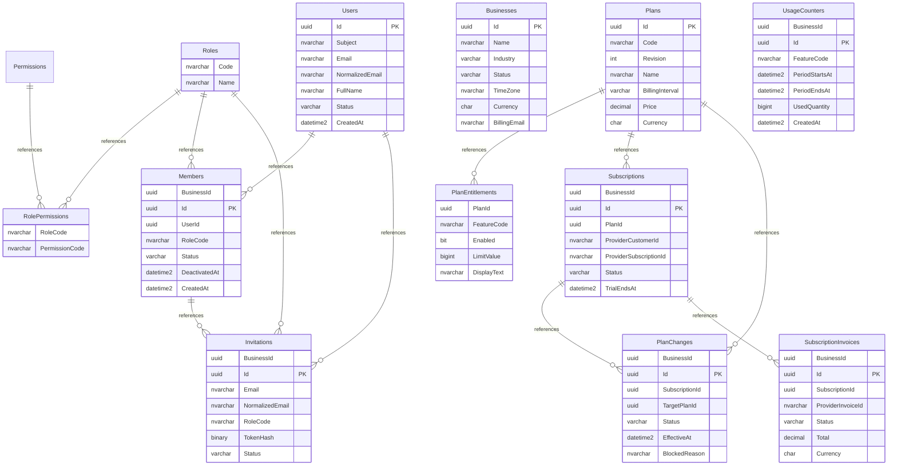
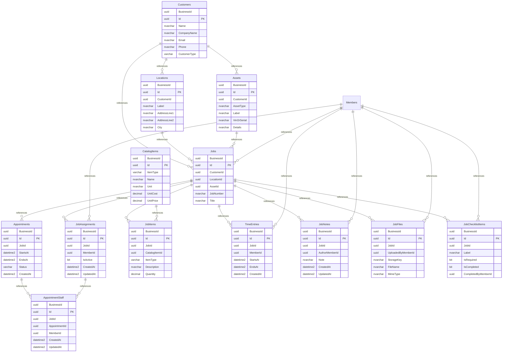
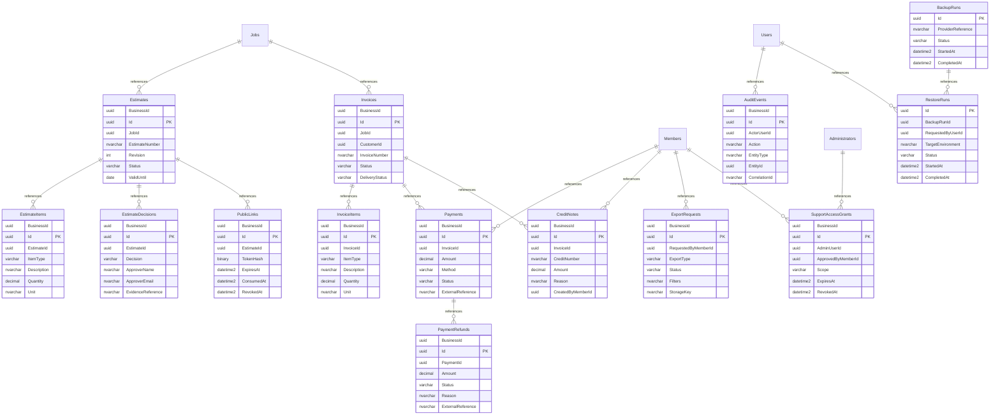

# Database relationships

SQL Server. Composite tenant keys are `(BusinessId, Id)`. All app tables reference Businesses; those repeated edges are omitted below for readability.

## Access and subscriptions

## Service operations

## Documents and controls

Optional nullable foreign keys are shown as general one-to-many relationships here; SQL is authoritative for nullability and constraints.
